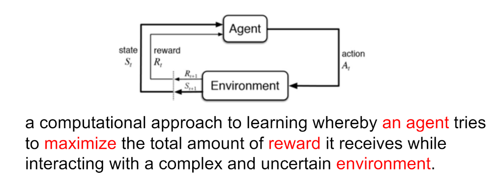
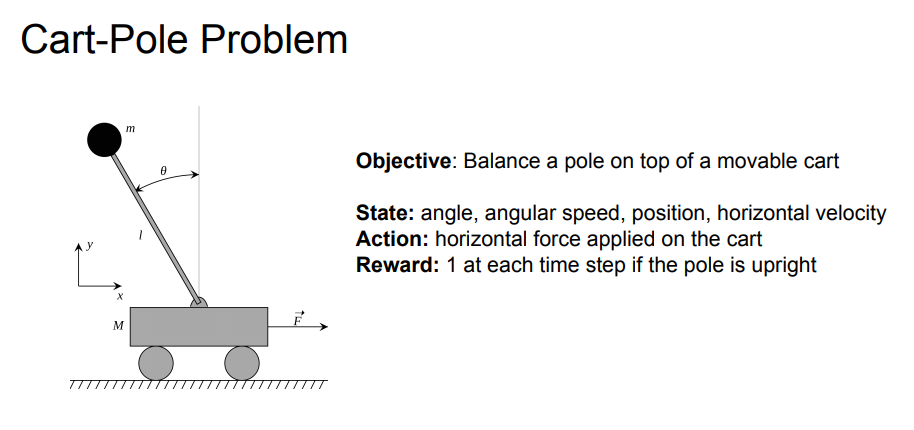

# Team learning for reinforcement learning

## Task 1

### What is Reinforcement Learning

Problems involving an agent interacting with an environment, which provides numeric reward
signals.  
Goal: Learn how to take actions
in order to maximize reward.

### Difference with supervised learning

- Data are not i.i.d. instead, a correlated time series data
- The learner is not told which actions to take, but instead must discover which actions yield the most reward by exploring
- No instant feedback or label for correct action
- Upper bound for supervised learning is human-performance but reinforcement learning is unknown

### Features of reinforcement learning

- need to explore new actions
- delayed reward
- sequential input data
- agent's actions affect the subsequent data it receives.

Deep Reinforcement Learning：do not need features engineering and use end-to-end training.  

Key elements of an RL agent: model, value, policy

## Task 2

### Markov decision processes (MDP)

1. the history of states  $h_t = {s_1, s_2, ..., s_t}$
2. the next state is only related to currently state
3. state $s_t$ meets:
    $$ p(s_{t+1}| s_t) = p(s_{t+1}|h_t)\\
        p(s_{t+1}|s_t, a_t) = p(s_{t+1}| h_t, a_t) $$

